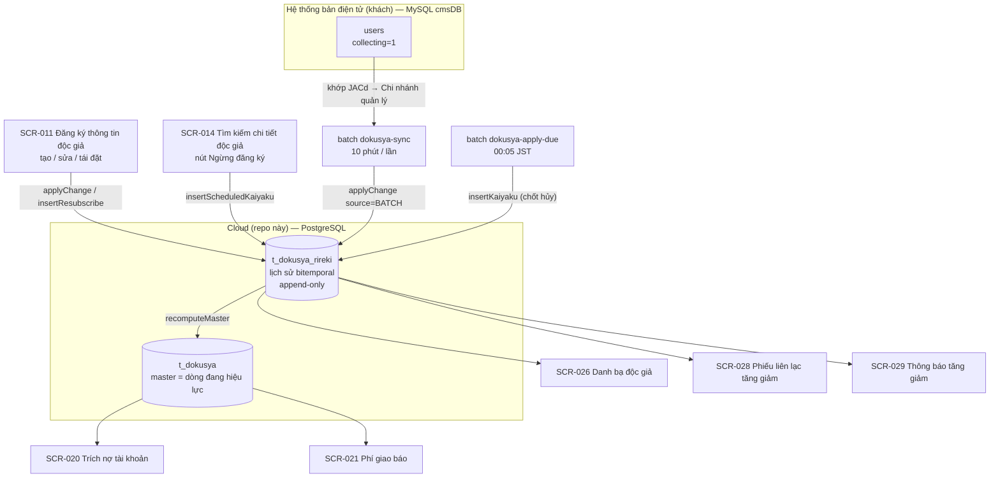

# Kịch bản demo — vòng đời độc giả và các màn hình báo cáo (AgriNews ACSMS)

Chạy tuần tự **TC-001 → TC-031**: đi hết vòng đời một độc giả (**tạo → đồng bộ → hủy → tái đặt**), sau đó cho thấy từng thay đổi đó nổi lên ở 5 màn hình báo cáo như thế nào.

> Note: Toàn bộ dữ liệu nằm trong **một JA riêng** (`JA Demo` / 1139000000) nên màn hình chỉ hiện đúng những gì kịch bản nói tới, không lẫn 121 độc giả bản điện tử đã đồng bộ từ dữ liệu thật của khách.
> Tài khoản test: **demo_honten / admin@1234567** (vai trò JA trụ sở chính, JA = `JA Demo`) — dùng cho toàn bộ kịch bản. Tài khoản phụ **demo_shiten / admin@1234567** (vai trò JA chi nhánh quản lý) chỉ dùng khi muốn so sánh DataScope (chỉ thấy `Chi nhánh Trung tâm Demo`).
> Công cụ đối chiếu: màn hình + psql (`t_dokusya`, `t_dokusya_rireki`) qua script [`verify-demo-data.sql`](./verify-demo-data.sql). **Không dựa vào log batch** — trên môi trường thật người demo không xem được stdout của batch.
> File liên quan: seeder `apps/backend/scripts/seed-demo-scenario.ts` · dữ liệu bản điện tử `apps/docker/denshiban-mysql/demo/demo-users.sql`.
> Ngoài phạm vi: đẩy dữ liệu chiều đi cloud → bản điện tử (xem [`Scenario_denshiban_push_pull.md`](../design-vi/Scenario_denshiban_push_pull.md)); import Excel SCR-016.

> ### ⚠ Môi trường thật vs môi trường local
>
> Kịch bản này mặc định chạy trên **môi trường thật**, ở đó:
>
> | | Môi trường thật (mặc định) | Môi trường local |
> |---|---|---|
> | Batch đồng bộ `dokusya-sync` | Tự chạy **10 phút/lần**, không gọi tay được | Gọi tay được bằng npm script |
> | Batch chốt hủy `dokusya-apply-due` | Tự chạy **00:05 JST mỗi ngày**, không gọi tay được | Gọi tay được bằng npm script |
> | `cmsDB` phía bản điện tử | **DB thật của khách, READ-ONLY** — không nạp thêm, không sửa được | Container mock, ghi thoải mái |
> | Log batch | Không xem được | `docker compose logs batch-scheduler` |
>
> Hệ quả: mọi bước "chạy lệnh batch" đã được thay bằng "**chờ tới chu kỳ**", và các test case bắt buộc phải ghi vào `cmsDB` được đánh dấu 🔧 **chỉ chạy được ở local** — bỏ qua khi demo cho khách.
>
> ### Bảng quy đổi số liệu trên môi trường thật
>
> Vì không nạp được `同期一太` / `併読二美` vào JA demo, các con số ghi trong TC (vốn tính cho môi trường local) phải trừ đi 2 độc giả đó:
>
> | Vị trí | Local (như ghi trong TC) | Môi trường thật |
> |---|---|---|
> | SCR-014 — tổng độc giả JA demo | 12 | **10** |
> | TC-025 SCR-026 — số dòng danh bạ | 11 | **9** (nhóm `9999999999 Bản điện tử` chỉ còn `電子七海`) |
> | TC-020 — đối chiếu "12 độc giả" | 12 | **10**, và bỏ 2 gạch đầu dòng nói về `併読二美` / `同期一太` |
> | TC-024 — danh sách bị loại | có `同期一太`, `併読二美` | chỉ còn `電子七海` |
> | Phần **H** của `verify-demo-data.sql` | 2 dòng | **0 dòng** |
> | Phụ lục A — dòng DMS1 / DMS2 | có | không tồn tại |
>
> Các con số của SCR-020 (TC-019: 7 dòng) và SCR-021 (TC-023: 2 đại lý) **không đổi** — hai độc giả đó vốn đã bị loại khỏi hai báo cáo này.

---

## 0. Chuẩn bị (làm 1 lần, không tính là test case)

### 0.1 Dựng dữ liệu

**Bước ① + ③ — chạy ở mọi môi trường:**

```bash
# ① Master + 10 độc giả demo (idempotent; --reset để làm lại từ đầu)
npm run seed:demo
#   làm lại:  npm run seed:demo -- --reset

# ③ Kiểm tra trước khi demo — số dòng phải khớp chú thích trong file
psql -U postgres -d <db> < docs/design-vi/demo/verify-demo-data.sql
```

Ở local, hai lệnh trên chạy qua docker:

```bash
cd apps
docker compose up -d postgres redis denshiban-mysql backend
docker compose exec backend npm run seed:demo
cd ..
docker exec -i agrinews-postgres-1 psql -U postgres -d agrinews_dev \
  < docs/design-vi/demo/verify-demo-data.sql
```

**Bước ② — 🔧 chỉ ở môi trường local.** Nạp 2 hội viên demo vào mock `cmsDB` để phần đồng bộ có dữ liệu mới:

```bash
docker exec -i agrinews-denshiban-mysql-1 \
  mysql -uroot -prootpassword --default-character-set=utf8mb4 cmsDB \
  < apps/docker/denshiban-mysql/demo/demo-users.sql
```

> `--default-character-set=utf8mb4` là **bắt buộc**. Client `mysql` mặc định latin1; thiếu cờ này thì tên tiếng Nhật lưu vào thành `一太…` và độc giả đồng bộ sang cloud cũng mang tên hỏng.
> **Trên môi trường thật KHÔNG có bước ②** — `cmsDB` là DB thật của khách, chỉ đọc. Vì thế hai độc giả `同期一太` / `併読二美` **sẽ không tồn tại**, và phần **H** của `verify-demo-data.sql` (lọc theo JA demo) trả về **0 dòng** — đó là đúng, không phải lỗi. Nhóm test case đồng bộ được viết lại theo hướng quan sát dữ liệu đã đồng bộ sẵn, xem mục tương ứng bên dưới.

### 0.2 Ngày tháng phải gõ vào màn hình

Seeder tính ngày **tương đối theo ngày chạy** và in bảng này ở cuối. Ví dụ dưới đây là kết quả seed ngày **2026-08-07**:

| Màn hình | Ô nhập | Giá trị |
|---|---|---|
| SCR-020 Xuất dữ liệu trích nợ tài khoản | Tháng đối tượng | `2026-08-01` (đầu tháng hiện tại) |
| SCR-021 Xuất thông tin thanh toán | Tháng đối tượng | `2026-08-01` |
| SCR-026 Xuất danh bạ độc giả | Ngày chuẩn | `2026-08-07` (hôm nay) |
| SCR-028 Phiếu liên lạc tăng giảm (đại lý) | Ngày áp dụng | `2026-09-01` (đầu tháng sau) |
| SCR-029 Thông báo tăng giảm (Nhật Báo Nông Nghiệp) | Ngày áp dụng | `2026-09-01` |
| Tái đặt (TC-016) | Ngày bắt đầu đăng ký | `2026-10-01` (chỉ nhận ngày tương lai) |

> **SCR-028/029 lọc bằng `joho_henko_tekiyo_date = <Ngày áp dụng>` — so sánh BẰNG chính xác, không phải `<=`.** Gõ sai ngày một hôm là ra 0 dòng, không phải lỗi hệ thống. Đây là câu hỏi hay bị hỏi nhất trong demo.

### 0.3 Master data đã có sẵn

| Loại (bảng) | Mã | Ghi chú |
|---|---|---|
| JA / `m_ja` | `1139000000` `JA Demo` | Hợp tác xã đơn vị (không phải Hội trung ương), thuế nội bao (`zei_kubun=1`) |
| Chi nhánh quản lý / `m_kanri_shiten` | `113-9000-001` `Chi nhánh Trung tâm Demo`<br>`113-9000-002` `Chi nhánh Bắc Demo` | `113-9000-001` bỏ gạch nối = `1139000001` — chính là `JACd` bên bản điện tử (TC-006) |
| Chi nhánh / `m_shiten` | `001` `Trụ sở chính Demo`<br>`002` `Chi nhánh Bắc Demo` | `kinyu_shiten_flg=true` → dùng làm chi nhánh trích nợ ở SCR-020 |
| Đại lý / `m_hanbaiten` | `DM001` `Đại lý Trung tâm Demo`<br>`DM002` `Đại lý Bắc Demo`<br>`DM003` `Đại lý Ngừng hoạt động Demo` (`haiten_flg=true`)<br>`9999999999` `Bản điện tử` (dummy) | DM001/DM002 có `haitatsuryo_tanka_id` → xuất hiện ở SCR-021 |
| Đơn giá / `m_tanka` | `DMT001` `Phí đăng ký` 3.400 yên (`tanka_type=1`)<br>`DMT002` `Phí giao báo` 550 yên (`tanka_type=2`) | Cả hai `active_flg=true`; hết hiệu lực là biến mất khỏi báo cáo |

### 0.4 Toàn cảnh luồng dữ liệu



Ý chính cần nói khi demo: **mọi thao tác đều ghi thêm một dòng vào `t_dokusya_rireki`, không sửa đè.** `t_dokusya` chỉ là ảnh chụp của dòng đang có hiệu lực tại hôm nay, do `recomputeMaster` tính lại. Vì thế báo cáo *trạng thái* (SCR-020, SCR-021) đọc `t_dokusya`; báo cáo *biến động* (SCR-026, SCR-028, SCR-029) đọc `t_dokusya_rireki`; và sửa với ngày áp dụng tương lai = "đặt lịch" — lịch sử có ngay, master chưa đổi.

---

## Màn hình SCR-011 — Đăng ký thông tin độc giả (Tạo mới / Sửa)

> Note: URL `/dokusya/create` (đăng ký mới) và `/dokusya/{id}/edit` (chỉnh sửa). Vào từ sidebar → Tìm kiếm chi tiết độc giả → nút Đăng ký mới.
> Màn Lịch sử để đối chiếu: `/dokusya/{id}/rireki` (SCR-013 Thông tin lịch sử độc giả).
> Điều kiện: đã chạy bước ① ở §0.1; login demo_honten.

### 1. Tạo mới độc giả

| Scenario ID | Scenario Name | Pre-condition | Steps | Expected Result |
| --- | --- | --- | --- | --- |
| TC-001 | Check tạo mới độc giả bản giấy → sinh đúng 1 dòng lịch sử, hiện ngay trên danh sách dù ngày bắt đầu ở tương lai | Login demo_honten / admin@1234567 | 1. Sidebar → Tìm kiếm chi tiết độc giả → click Đăng ký mới.<br>2. Loại đăng ký: chọn **Bản giấy**. Loại thủ tục: **Đăng ký mới**.<br>3. Chi nhánh quản lý: **`Chi nhánh Trung tâm Demo`**. Đại lý: **`DM001 Đại lý Trung tâm Demo`**.<br>4. Nhập Họ tên độc giả (Họ/Tên), Phiên âm kana độc giả, Mã bưu điện, Tỉnh/Thành, Quận/Huyện/Xã, Số nhà, Liên hệ 1.<br>5. Đơn giá báo: **`DMT001 Phí đăng ký Demo (theo tháng)`**. Số bản đăng ký: **1**.<br>6. Phương thức thanh toán: **Trích nợ tài khoản** → màn hình hiện thêm nhóm trường ngân hàng, nhập đủ.<br>7. Ngày bắt đầu đăng ký: chọn **ngày mai** (hoặc muộn hơn).<br>8. Click Đăng ký. | - Toast `Đã đăng ký.`, quay về màn Tìm kiếm chi tiết độc giả.<br>- Danh sách hiện ngay độc giả vừa tạo, dù Ngày bắt đầu đăng ký ở tương lai.<br>- Mở SCR-013 (`/dokusya/{id}/rireki`): đúng **1 dòng**, `rireki_no = 1`, Cờ đăng ký mới = true, Ngày áp dụng thay đổi thông tin = Ngày bắt đầu đăng ký (khi tạo mới hai giá trị này bằng nhau).<br>- Cờ dữ liệu mới nhất chưa bật — batch bật khi tới ngày hiệu lực. |
| TC-002 | Check Ngày bắt đầu đăng ký = hôm nay bị chặn với Loại đăng ký = Bản giấy | Login demo_honten | 1. Mở `/dokusya/create`, Loại đăng ký = **Bản giấy**.<br>2. Nhập đủ các trường bắt buộc.<br>3. Ngày bắt đầu đăng ký: chọn **hôm nay**.<br>4. Click Đăng ký. | - Hiển thị lỗi `Vui lòng nhập Ngày bắt đầu đăng ký sau ngày hôm nay.` ngay dưới trường Ngày bắt đầu đăng ký.<br>- Không tạo record ở cloud.<br>- Guard tồn tại ở **cả FE lẫn BE** (`dokusya.service.ts` `create`) — thử gọi thẳng API cũng bị chặn.<br>- Với Bản điện tử thì hôm nay được chấp nhận (khác biệt theo Loại đăng ký). |
| TC-003 | Check không tạo được Đọc song song từ màn hình (chỉ sinh qua đồng bộ) | Login demo_honten | 1. Mở `/dokusya/create`.<br>2. Xem nhóm radio Loại đăng ký.<br>3. Thử click option Đọc song song (Bản giấy + Bản điện tử). | - Option Đọc song song (Bản giấy + Bản điện tử) của trường Loại đăng ký bị **disabled** (xám), không thể chọn — chỉ chọn được Bản giấy / Bản điện tử.<br>- Không tạo được record Đọc song song từ màn hình.<br>- Ý nghĩa: loại Đọc song song chỉ ra đời qua batch đồng bộ (TC-006, độc giả `併読二美`) — cloud không tự quyết định một người vừa đọc báo giấy vừa đọc bản điện tử. |

### 2. Sửa độc giả — Thay đổi trong ngày / Thay đổi đặt lịch

> Note: Màn Sửa **mở ra ở chế độ tham chiếu (read-only)**, phải chọn chế độ thay đổi trước khi sửa được.
> Ba dòng biến động lên báo cáo ở TC-027 (`増部二郎`, `移転三郎`, `転居四郎`) đã được seeder tạo sẵn; hai TC dưới đây làm sống lại chính thao tác đó để khách thấy đường đi.
>
> ⚠ **TC-005 làm lệch baseline của phần báo cáo.** Nó tạo thêm một dòng tăng giảm cho `継続一郎`, nên SCR-028/029 sẽ ra **5 dòng** thay vì 4 (TC-027, TC-030) và `継続一郎` sẽ có Số bản đăng ký = 4 khi tới TC-012. Chọn một trong hai:
> - **Bỏ qua TC-005** nếu muốn số liệu báo cáo khớp đúng bảng ở các TC bên dưới (khuyến nghị khi demo cho khách) — dữ liệu seed sẵn đã đủ minh hoạ cả 4 loại biến động.
> - **Chạy TC-005** rồi vào SCR-013 bấm Hủy bỏ dòng vừa tạo để trả baseline về 4 dòng trước khi sang phần báo cáo.

| Scenario ID | Scenario Name | Pre-condition | Steps | Expected Result |
| --- | --- | --- | --- | --- |
| TC-004 | Check Thay đổi trong ngày chặn các trường ảnh hưởng chứng từ (với Bản giấy) | Có độc giả Bản giấy đang Đang đăng ký (ví dụ `継続一郎`) | 1. SCR-014 → mở `継続 一郎` → Sửa.<br>2. Ở thanh chọn chế độ, chọn **Thay đổi trong ngày** (Ngày áp dụng = hôm nay, không sửa được).<br>3. Thử sửa Số bản đăng ký / Đại lý / địa chỉ độc giả / địa chỉ giao báo. | - Các trường trên **bị khoá**, không sửa được ở chế độ Thay đổi trong ngày (danh sách đầy đủ: hằng `REPORT_FIELD_PAIRS` trong `dokusya-shubetsu.rules.ts` — số bản, đại lý, 5 trường địa chỉ độc giả, 5 trường địa chỉ giao báo).<br>- Các trường khác (Liên hệ, Ghi chú, …) vẫn sửa bình thường.<br>- Lý do nghiệp vụ: phiếu tăng giảm của hôm nay có thể đã in và gửi cho đại lý; sửa ngược lại làm giấy và dữ liệu lệch nhau. Hệ thống ép những thay đổi đó đi qua đường đặt lịch.<br>- Với Loại đăng ký = Bản điện tử thì Thay đổi trong ngày sửa được mọi trường (không có chứng từ giấy). |
| TC-005 | Check Thay đổi đặt lịch tạo dòng tăng giảm cho ngày tương lai | Có độc giả Bản giấy đang Đang đăng ký | 1. SCR-014 → mở `継続 一郎` → Sửa.<br>2. Chọn **Thay đổi đặt lịch** → popup nhập Ngày áp dụng = **2026-09-01**.<br>3. Đổi Số bản đăng ký (ví dụ 2 → 4).<br>4. Click Cập nhật.<br>5. Mở SCR-028 với Ngày áp dụng = 2026-09-01. | - Toast `Đã cập nhật.`<br>- SCR-013: thêm 1 dòng lịch sử với Ngày áp dụng thay đổi thông tin = 2026-09-01, Cờ báo cáo tăng giảm = true.<br>- SCR-014: Số bản đăng ký **vẫn là 2** — master chưa đổi vì ngày áp dụng còn ở tương lai.<br>- SCR-028: có thêm 1 dòng `継続一郎` Lần trước 2 → Lần này 4.<br>- Nút **Thay đổi đặt lịch bị disable với Loại đăng ký = Bản điện tử** (chỉ Bản giấy mới đặt lịch được). |

---

## Batch `dokusya-sync` — Đồng bộ chiều về (bản điện tử → cloud)

> Note: Đồng bộ **một chiều, kiểu pull**. Khoá đối chiếu: `cmsDB.users.id` ↔ `t_dokusya.denshi_kaiin_id`. Khoá tìm JA: `users.JACd` (bỏ gạch nối) ↔ `m_kanri_shiten.kanri_shiten_code`.
> Điều kiện lấy về: `Campagna_flg` rỗng/0 **và** (`collecting = 1` hoặc (`treatment = 1` và `payment_id = 6`)).
>
> **Cách kích hoạt — khác nhau theo môi trường:**
>
> | Môi trường | Kích hoạt | Chờ bao lâu |
> |---|---|---|
> | **Thật (demo)** | Không gọi tay được. Batch tự chạy **10 phút/lần** | Tối đa 10 phút cho 1 chu kỳ |
> | Local | `cd apps && docker compose exec backend npm run dokusya:sync:dev` | Ngay lập tức |
>
> **Mẹo canh chu kỳ**: batch chạy vào phút `:00, :10, :20, :30, :40, :50`. Bắt đầu nhóm test case này ngay sau một mốc đó thì chỉ phải chờ ~10 phút, thay vì lỡ nhịp mất 20 phút.
>
> **Cách biết batch vừa chạy** (không có log): chạy câu dưới trước và sau khi chờ — `MAX(created_at)` nhích lên là chu kỳ đã chạy xong.
>
> ```sql
> SELECT COUNT(*) AS so_doc_gia_dong_bo, MAX(created_at) AS lan_ghi_gan_nhat
>   FROM t_dokusya WHERE denshi_kaiin_id IS NOT NULL;
> ```
>
> ⚠ Trên môi trường thật `cmsDB` là **read-only** nên không thể tạo/sửa hội viên để ép batch sinh thay đổi. Nhóm test case dưới đây vì thế **quan sát dữ liệu đã đồng bộ sẵn** (các độc giả bản điện tử do batch tạo từ dữ liệu thật của khách) chứ không dựng dữ liệu mới. Các TC cần ghi vào `cmsDB` được đánh dấu 🔧 local-only.

| Scenario ID | Scenario Name | Pre-condition | Steps | Expected Result |
| --- | --- | --- | --- | --- |
| TC-006 | Check độc giả bản điện tử do batch đồng bộ tạo ra, có đủ dấu vết nhận biết | Cloud đã có ít nhất 1 độc giả đồng bộ (câu SQL ở bước 1 trả về > 0 dòng) | 1. Chạy psql để lấy danh sách độc giả do batch tạo và chọn 1 người làm mẫu:<br>`SELECT dokusya_id, denshi_kaiin_id, shimei_sei, shimei_mei, dokusya_shubetsu, hanbaiten_id, created_by FROM t_dokusya WHERE denshi_kaiin_id IS NOT NULL ORDER BY created_at DESC LIMIT 5;`<br>2. Mở độc giả mẫu đó trên SCR-014 → SCR-011.<br>3. Mở SCR-013 của độc giả đó. | - Mọi dòng đều có Người tạo = `SYSTEM_DENSHI_SYNC` và `denshi_kaiin_id` khác NULL — đây là **dấu vết duy nhất** phân biệt độc giả đồng bộ với độc giả nhập tay.<br>- Loại đăng ký chỉ là **2 (Bản điện tử)** hoặc **3 (Đọc song song)**; Loại 3 xuất hiện khi bên bản điện tử có `paper_permission_dt` khác rỗng.<br>- `denshi_kaiin_id` chính là `users.id` bên bản điện tử — khoá đối chiếu 2 hệ thống.<br>- SCR-013: Ngày áp dụng thay đổi thông tin = **ngày batch chạy**, không phải ngày bắt đầu đăng ký bên bản điện tử.<br>- ⚠ **DataScope**: tài khoản `demo_honten` chỉ thấy JA demo nên **sẽ không thấy** các độc giả này trên màn hình. Dùng tài khoản có phạm vi tới JA tương ứng (hoặc vai trò Nichino) ở bước 2-3; nếu không có thì dừng ở bước 1 (psql). |
| TC-007 | Check Đại lý luôn là dummy, không lấy theo ShopCd của bản điện tử | TC-006 đã lấy được danh sách | 1. Chạy psql:<br>`SELECT DISTINCT hanbaiten_id FROM t_dokusya WHERE denshi_kaiin_id IS NOT NULL;`<br>2. Mở độc giả mẫu trên SCR-011, xem trường Đại lý. | - Câu SQL trả về **đúng 1 giá trị** — id của đại lý dummy `9999999999 Bản điện tử`. Không có ngoại lệ, kể cả bản Đọc song song có `ShopCd` bên bản điện tử.<br>- Theo yêu cầu khách 2026-08: đồng bộ **không** quyết định đại lý; người phụ trách giao báo được gán bên cloud qua SCR-011 / SCR-017.<br>- Đây cũng là lý do các độc giả này không lên SCR-021 (xem TC-024). |
| TC-008 | Check hội viên chưa map được Chi nhánh quản lý thì bị bỏ qua có kiểm soát | Đang ở môi trường thật, `cmsDB` chứa dữ liệu thật của khách | 1. Chạy psql xem các Chi nhánh quản lý thực sự có độc giả đồng bộ:<br>`SELECT k.kanri_shiten_code, COUNT(*) FROM t_dokusya d JOIN m_kanri_shiten k ON k.kanri_shiten_id = d.kanri_shiten_id WHERE d.denshi_kaiin_id IS NOT NULL GROUP BY 1 ORDER BY 1;`<br>2. Đối chiếu với tổng số hội viên bên bản điện tử (nếu có quyền SELECT `cmsDB`). | - Chỉ những `JACd` **có `m_kanri_shiten` tương ứng bên cloud** mới sinh ra độc giả; phần còn lại batch bỏ qua **có kiểm soát**, không tạo rác và không báo lỗi.<br>- Quy tắc khớp: `users.JACd` bỏ gạch nối = `m_kanri_shiten.kanri_shiten_code` bỏ gạch nối (ví dụ `113-9000-001` ↔ `1139000001`).<br>- Ý nghĩa: muốn đồng bộ thêm JA nào thì **nạp master JA / Chi nhánh quản lý của JA đó trước**, batch tự lấy về ở chu kỳ kế tiếp — không cần can thiệp gì bên bản điện tử.<br>- Đây là câu trả lời cho câu hỏi "sao hệ thống khách có 15 vạn hội viên mà cloud chỉ thấy vài trăm". |
| TC-009 | Check batch idempotent — chạy nhiều chu kỳ không tạo trùng | Đã ở đầu một chu kỳ 10 phút (xem "Mẹo canh chu kỳ" ở trên) | 1. Ghi lại số liệu gốc:<br>`SELECT COUNT(*) AS tong, MAX(created_at) AS lan_cuoi FROM t_dokusya WHERE denshi_kaiin_id IS NOT NULL;`<br>2. **Chờ qua 2 chu kỳ (~20 phút)** — trong lúc chờ demo tiếp các màn hình báo cáo rồi quay lại.<br>3. Chạy lại câu ở bước 1.<br>4. Kiểm tra trùng lặp:<br>`SELECT denshi_kaiin_id, COUNT(*) FROM t_dokusya WHERE denshi_kaiin_id IS NOT NULL GROUP BY 1 HAVING COUNT(*) > 1;` | - `tong` **không đổi** sau 2 chu kỳ — batch khớp theo `denshi_kaiin_id` nên chạy lại chỉ so sánh, không chèn thêm.<br>- Bước 4 trả về **0 dòng** — không có `denshi_kaiin_id` nào bị trùng.<br>- Không đẩy ngược lại bản điện tử: dòng do batch ghi có `source = 'BATCH'` nên bị loại khỏi luồng push (chống vòng lặp echo).<br>- Đây là test case đồng bộ **dễ demo nhất trên môi trường thật** vì không cần dựng dữ liệu — chỉ cần chờ. |
| TC-010 | Check thay đổi bên bản điện tử được cập nhật về cloud theo từng cột | 🔧 **Chỉ chạy được ở local** — cần quyền ghi vào `cmsDB` | 1. Sửa dữ liệu bên mock cmsDB:<br>`docker exec agrinews-denshiban-mysql-1 mysql -uroot -prootpassword --default-character-set=utf8mb4 cmsDB -e "UPDATE users SET city='Quận Minato', addr='Roppongi 9-9-9', updated_at=NOW() WHERE email='demo-sync-1@demo-agrinews.example.jp';"`<br>2. Chạy `npm run dokusya:sync:dev` (local) hoặc chờ 1 chu kỳ.<br>3. Mở SCR-011 và SCR-013 của `同期一太`. | - SCR-011: Quận/Huyện/Xã và Số nhà cập nhật theo giá trị mới.<br>- SCR-013: thêm dòng lịch sử thứ 2.<br>- Batch so sánh **theo từng cột**, chỉ ghi những cột thật sự đổi — không ghi đè cột do cloud quản lý (Đơn giá báo, Trạng thái duyệt).<br>- **Trên môi trường thật**: không ép được thay đổi vì `cmsDB` read-only. Thay bằng quan sát gián tiếp — tìm độc giả đồng bộ đã có nhiều hơn 1 dòng lịch sử, chính là bằng chứng batch từng cập nhật theo cột:<br>`SELECT d.dokusya_id, COUNT(r.*) AS so_dong_lich_su FROM t_dokusya d JOIN t_dokusya_rireki r ON r.dokusya_id = d.dokusya_id WHERE d.denshi_kaiin_id IS NOT NULL GROUP BY 1 HAVING COUNT(r.*) > 1 LIMIT 5;`<br>Mở SCR-013 của một trong số đó để chỉ ra các dòng nối tiếp nhau. |

---

## Màn hình SCR-014 — Tìm kiếm chi tiết độc giả (Hủy đăng ký — 2 pha)

> Note: URL `/dokusya`. Hủy đăng ký chạy **2 pha**, đây là chỗ dễ hiểu nhầm nhất nên demo tách rõ:
>
> | Pha | Ai làm | Ghi gì | Trạng thái |
> |---|---|---|---|
> | 1. Đặt lịch | Người dùng bấm Ngừng đăng ký ở SCR-014 | dòng lịch sử Số bản = 0, Cờ hủy = false | Còn hủy được |
> | 2. Chốt | Batch `dokusya-apply-due` (**00:05 JST** hằng ngày) khi tới ngày | dòng lịch sử Loại thủ tục = Hủy (0), Cờ hủy = true | Đã hủy, muốn quay lại phải **tái đặt** (TC-016) |
>
> Ràng buộc: Ngày ngừng đăng ký phải **lớn hơn hôm nay** và **>= Ngày bắt đầu đăng ký**. Với Bản điện tử màn hình cho chọn *tháng* và tự làm tròn về ngày cuối tháng.

### 1. Pha 1 — đặt lịch hủy

| Scenario ID | Scenario Name | Pre-condition | Steps | Expected Result |
| --- | --- | --- | --- | --- |
| TC-011 | Check trạng thái đã đặt lịch hủy: lịch sử có dòng giảm nhưng master chưa đổi | `解約五郎` đã được seed ở trạng thái đặt lịch (Ngày ngừng đăng ký = 2026-09-01) | 1. SCR-014 → tìm `解約 五郎`, xem các cột Số bản đăng ký / Loại thủ tục / Ngày ngừng đăng ký.<br>2. Mở SCR-013 của độc giả này. | - SCR-014: Số bản đăng ký **vẫn là 1** và Loại thủ tục **vẫn là Đăng ký mới**, chỉ cột Ngày ngừng đăng ký hiện `2026-09-01`.<br>- SCR-013 có 2 dòng: `rireki_no=1` đăng ký mới; `rireki_no=2` đặt lịch hủy với Số bản = 0, Ngày áp dụng = 2026-09-01, Báo cáo tăng giảm = true, Cờ hủy = false.<br>- Đúng thiết kế: dòng đặt lịch có ngày áp dụng ở tương lai nên chưa thành dòng hiệu lực; riêng **ngày hủy được đẩy lên master ngay** để nhân viên nhìn thấy.<br>- Dòng `rireki_no=2` này chính là dòng "giảm" xuất hiện ở TC-027. |
| TC-012 | Check thao tác Ngừng đăng ký làm phát sinh dòng trên phiếu tăng giảm | `継続一郎` đang Đang đăng ký với **2 bản**, chưa có đặt lịch hủy. Đã bỏ qua hoặc đã Hủy bỏ TC-005 (xem cảnh báo ở mục trên) nên SCR-028 đang có **4 dòng** | 1. SCR-014 → tìm `継続 一郎`.<br>2. Click nút **Ngừng đăng ký**.<br>3. Chọn Ngày ngừng đăng ký = `2026-09-01`, xác nhận.<br>4. Mở lại SCR-028 với Ngày áp dụng = `2026-09-01`.<br>5. Mở SCR-020 với Tháng đối tượng = `2026-08-01`. | - Toast `Đã đặt lịch ngừng đăng ký.`<br>- SCR-014: Ngày ngừng đăng ký = 2026-09-01, còn Số bản đăng ký = 2 và Loại thủ tục = Đăng ký mới giữ nguyên.<br>- SCR-028: **4 dòng → 5 dòng**, thêm `継続一郎` với Lần trước 2 → Lần này 0.<br>- SCR-029 cũng 4 → 5 dòng, tổng biến động thuần **+1 → −1**.<br>- SCR-020 (Tháng đối tượng = 2026-08-01) **không đổi**: ngày hủy nằm ở tháng 9 nên tháng 8 vẫn thu tiền.<br>- Đây là chỗ nối trực tiếp giữa thao tác trên màn hình và số liệu trên chứng từ. |
| TC-013 | Check không đặt lịch hủy 2 lần trên cùng bản ghi Bản giấy | `解約五郎` đã có đặt lịch hủy (TC-011) | 1. SCR-014 → tìm `解約 五郎`.<br>2. Click nút **Ngừng đăng ký** lần nữa. | - Hiển thị lỗi `Đã có đặt lịch hủy. Nếu muốn thay đổi, vui lòng hủy bỏ dòng hủy ở màn hình lịch sử.`<br>- Với Bản giấy: muốn đổi lịch phải vào SCR-013 hủy bỏ dòng đặt lịch trước đã.<br>- Với Bản điện tử: popup cho sửa / gỡ trực tiếp, không cần qua màn lịch sử. |

### 2. Pha 2 — batch chốt hủy

> Note: Batch này chạy **00:05 JST mỗi ngày** (`5 0 * * *` JST — xem `docs/batch-implementation-plan.md`).
> `即解八郎` đã được seed ở trạng thái "**đã tới ngày nhưng batch chưa chạy**": Ngày ngừng đăng ký = hôm qua, Số bản đăng ký = 0, Loại thủ tục vẫn là Đăng ký mới.
>
> **⚠ Trên môi trường thật không kích hoạt được batch này trong lúc demo** — nó chỉ chạy lúc 00:05. Hai cách demo pha 2:
>
> | Cách | Làm gì | Demo được gì |
> |---|---|---|
> | **A. Seed từ hôm trước** (khuyến nghị) | Chạy `seed:demo` **chiều/tối hôm trước** → 00:05 batch tự chốt → sáng hôm sau demo | Xem được **kết quả sau chốt** (TC-014 cột "sau batch") |
> | **B. Seed trong ngày demo** | Chạy `seed:demo` ngay trước khi demo | Chỉ xem được **trạng thái trung gian** giữa 2 pha (`即解八郎` số bản = 0 nhưng chưa chuyển Hủy) — vẫn là điểm đáng nói, xem TC-025 |
>
> Chọn cách nào thì các số liệu báo cáo khác nhau: cách A cho SCR-020 = 6 dòng / SCR-026 = 10 dòng; cách B cho 7 và 11. Bảng ở các TC báo cáo bên dưới ghi theo **cách B** (chưa chạy batch).
>
> Ở local vẫn gọi tay được: `cd apps && docker compose exec backend npm run dokusya:apply-due:dev`.

| Scenario ID | Scenario Name | Pre-condition | Steps | Expected Result |
| --- | --- | --- | --- | --- |
| TC-014 | Check batch chốt hủy khi tới ngày hiệu lực | Đã seed theo **cách A** (từ hôm trước) nên batch 00:05 đã chạy qua. Ở local: gọi tay `npm run dokusya:apply-due:dev` | 1. Mở SCR-014, tìm `即解 八郎`, xem cột Loại thủ tục.<br>2. Mở SCR-013 của `即解八郎`.<br>3. Đối chiếu psql:<br>`SELECT rireki_no, tetsuzuki_shurui, kaiyaku_flg, created_by FROM t_dokusya_rireki r JOIN t_dokusya d USING (dokusya_id) WHERE d.shimei_sei = '即解' ORDER BY rireki_no;` | - SCR-014: `即解八郎` chuyển Loại thủ tục sang **Hủy**.<br>- SCR-013: thêm `rireki_no = 3` với Người tạo = `SYSTEM_BATCH_NIGHTLY`, Cờ hủy = true — **`SYSTEM_BATCH_NIGHTLY` là bằng chứng dòng này do batch đêm ghi**, không phải người dùng thao tác.<br>- **Sau batch này SCR-020 còn 6 dòng và SCR-026 còn 10 dòng** (thay vì 7 và 11). Bảng ở các TC báo cáo bên dưới ghi theo trạng thái **chưa chạy batch** — nếu seed theo cách A thì trừ đi `即解八郎`.<br>- Điều kiện tới hạn khác nhau theo loại: Bản giấy `Ngày ngừng <= hôm nay`; Bản điện tử / Đọc song song `Ngày ngừng < hôm nay`.<br>- Nếu seed theo **cách B**: bước 1 vẫn thấy Loại thủ tục = Đăng ký mới và SCR-013 chỉ có 2 dòng — đó là trạng thái trung gian đúng, không phải lỗi (xem TC-025). |
| TC-015 | Check batch idempotent — chạy qua nhiều đêm không sinh thêm dòng | TC-014 đã xong. Trên môi trường thật cần seed từ **2 ngày trước** (batch đã chạy qua 2 đêm). Ở local: gọi tay lần thứ hai | 1. Mở lại SCR-013 của `即解八郎`, đếm số dòng lịch sử.<br>2. Đối chiếu psql bằng câu ở TC-014 bước 3. | - Không phát sinh `rireki_no = 4`; số dòng lịch sử giữ nguyên dù batch đã chạy thêm đêm nữa.<br>- Hàm `insertKaiyaku` gặp Cờ hủy = true là bỏ qua.<br>- ⚠ Trên môi trường thật TC này **cần chuẩn bị trước 2 ngày**; nếu không kịp thì bỏ qua khi demo và chỉ nêu cơ chế chặn — TC-009 đã minh hoạ tính idempotent bằng batch đồng bộ với chi phí chờ thấp hơn nhiều. |

---

## Màn hình SCR-011 — Đăng ký thông tin độc giả (Tái đặt — đăng ký lại)

> Note: `再開六子` đã hủy xong từ 3 tháng trước (Loại thủ tục = Hủy, Số bản đăng ký = 0, Ngày bắt đầu đăng ký = `2026-04-01`, Ngày ngừng đăng ký = `2026-05-01`, 3 dòng lịch sử).
> Bản ghi đã hủy **không hiện thanh chọn Thay đổi trong ngày / Thay đổi đặt lịch** — form mở ra ở trạng thái sửa được luôn, vì đây là luồng tái đặt.

| Scenario ID | Scenario Name | Pre-condition | Steps | Expected Result |
| --- | --- | --- | --- | --- |
| TC-016 | Check tái đặt độc giả đã hủy → mở lại vòng đời mới trên cùng ID độc giả | `再開六子` ở trạng thái Hủy | 1. SCR-014 → mở `再開 六子` → Sửa.<br>2. Đổi **Loại thủ tục từ Hủy → Đăng ký mới**.<br>3. Quan sát các trường tự đổi theo.<br>4. Sửa Ngày bắt đầu đăng ký thành **2026-10-01**.<br>5. Chọn lại Đơn giá / Đại lý nếu muốn khác vòng đời trước.<br>6. Click Cập nhật. | - Ngay khi đổi Loại thủ tục, FE tự: Số bản đăng ký 0 → **1**; Ngày bắt đầu đăng ký → **ngày mai**; Ngày ngừng đăng ký → **xoá trắng**.<br>- Toast `Đã cập nhật.`<br>- SCR-013: thêm dòng mới có Cờ đăng ký mới = true — theo thiết kế DB, "Hủy → Đăng ký lại" cũng được đánh dấu là mới. Đây là lý do một độc giả có thể có **nhiều vòng đời** trong cùng một `dokusya_id`.<br>- SCR-014: Loại thủ tục = Đăng ký mới, Số bản đăng ký = 1, Ngày ngừng đăng ký rỗng — `recomputeMaster` chỉ nhìn trong vòng đời hiện tại nên ngày hủy của vòng đời cũ không còn ảnh hưởng. |
| TC-017 | Check Ngày bắt đầu đăng ký chỉ sửa được khi chuyển Hủy → Đăng ký mới | Có độc giả đang Đang đăng ký (`継続一郎`) và độc giả đã hủy (`再開六子`) | 1. Mở `継続一郎` → Sửa → thử sửa Ngày bắt đầu đăng ký.<br>2. (Kiểm chứng phía server) Gọi thẳng `PUT /api/v1/dokusya/{id}` với `dokusya_kaishi_date` khác giá trị đã lưu.<br>3. Mở `再開六子`, đổi Loại thủ tục sang Đăng ký mới → thử sửa Ngày bắt đầu đăng ký thành ngày quá khứ. | - Bước 1: trường Ngày bắt đầu đăng ký bị khoá ở mọi trường hợp trừ luồng tái đặt.<br>- Bước 2: BE **ghim lại giá trị cũ** (`dokusya.service.ts`, nhánh `[kaishi-date-immutable]`) — sửa DOM ở FE không vượt qua được.<br>- Bước 3: ngày bắt đầu mới bắt buộc là **ngày tương lai**, báo lỗi `Vui lòng nhập Ngày bắt đầu đăng ký sau ngày hôm nay.` giống lúc đăng ký mới. |
| TC-018 | Check master hiện ngay nhưng danh bạ theo ngày cơ sở thì chưa — minh hoạ mô hình bitemporal | TC-016 đã hoàn tất (`再開六子` có Ngày bắt đầu đăng ký = 2026-10-01) | 1. SCR-014: xem `再開六子`.<br>2. SCR-026 với Ngày chuẩn = `2026-08-07` (hôm nay) → xuất PDF.<br>3. SCR-026 với Ngày chuẩn = `2026-10-01` → xuất lại. | - Bước 1: SCR-014 hiện Loại thủ tục = Đăng ký mới, Số bản đăng ký = 1 **ngay lập tức**, dù ngày bắt đầu ở tương lai. `recomputeMaster` cố ý làm vậy: trong vòng đời mới chưa có dòng nào tới hạn thì lấy chính dòng đăng ký lại — giống hệt đăng ký mới với ngày bắt đầu tương lai vẫn hiện ngay trong danh sách.<br>- Bước 2: danh bạ **KHÔNG** có `再開六子` — tính đến hôm nay, dòng mới nhất vẫn là dòng Hủy (áp dụng từ 3 tháng trước).<br>- Bước 3: `再開六子` xuất hiện.<br>- Cặp đối lập này (master hiện ngay ↔ danh bạ theo ngày cơ sở) là cách gọn nhất để giải thích mô hình bitemporal cho khách.<br>- Muốn `再開六子` lên SCR-020 thì phải đổi Phương thức thanh toán sang Trích nợ tài khoản và nhập nhóm ngân hàng (bản seed để Thu tiền mặt), và sớm nhất cũng từ Tháng đối tượng = 2026-10-01. |

---

## Màn hình SCR-020 — Xuất dữ liệu trích nợ tài khoản

> Note: URL `/koza-furikae`. Đọc **master** `t_dokusya`. Điều kiện lọc: Phương thức thanh toán = Trích nợ tài khoản **và** Loại thủ tục = Đăng ký mới **và** (Bản giấy hoặc Bản điện tử đã duyệt + trả phí) **và** Ngày bắt đầu đăng ký <= Tháng đối tượng **và** (Ngày ngừng đăng ký rỗng hoặc > Tháng đối tượng), INNER JOIN sang `m_tanka` (`tanka_type = 1`, còn hiệu lực).

| Scenario ID | Scenario Name | Pre-condition | Steps | Expected Result |
| --- | --- | --- | --- | --- |
| TC-019 | Check xuất danh sách trích nợ tháng hiện tại | Login demo_honten. Chưa chạy batch TC-014 (nếu đã chạy thì kết quả là 6 dòng) | 1. Sidebar → Xuất dữ liệu trích nợ tài khoản.<br>2. Tháng đối tượng = `2026-08-01`.<br>3. Click Tìm kiếm. | - **7 dòng**, tất cả Số tiền trích nợ = 3.400 yên:<br>`継続一郎` (Bản giấy, `001 Trụ sở chính Demo`)<br>`増部二郎` (Bản giấy, `001`)<br>`移転三郎` (Bản giấy, `001`)<br>`転居四郎` (Bản giấy, `002 Chi nhánh Bắc Demo`)<br>`解約五郎` (Bản giấy, `002`)<br>`電子七海` (Bản điện tử, `001`)<br>`即解八郎` (Bản giấy, `002`) ← biến mất sau batch TC-014.<br>- Click CSV xuất được file định dạng Zengin. |
| TC-020 | Check các trường hợp bị loại khỏi danh sách trích nợ | TC-019 đã chạy | 1. Đối chiếu 12 độc giả trên SCR-014 với 7 dòng ở TC-019.<br>2. Với từng người bị thiếu, mở SCR-011 xem lý do. | Bị loại và lý do:<br>- `現金九郎`, `廃店十郎` → Phương thức thanh toán = **Thu tiền mặt** (điều kiện: `shiharai_hoho = 1`).<br>- `再開六子` → đã hủy (điều kiện: `tetsuzuki_shurui = 1`).<br>- `併読二美` → Đọc song song không thuộc diện trích nợ (chỉ nhận Bản giấy hoặc Bản điện tử).<br>- `同期一太` → xem TC-022. |
| TC-021 | Check độc giả đã đặt lịch hủy vẫn bị trích nợ ở tháng trước ngày hủy | `解約五郎` có Ngày ngừng đăng ký = 2026-09-01 | 1. Chạy TC-019 với Tháng đối tượng = `2026-08-01`, tìm `解約 五郎`.<br>2. Chạy lại với Tháng đối tượng = `2026-09-01`. | - Tháng 8: **có** `解約五郎` — ngày hủy 2026-09-01 lớn hơn tháng đối tượng nên tháng 8 vẫn phải thu tiền.<br>- Tháng 9: rớt khỏi danh sách.<br>- Chi tiết này thường được khách hỏi; điều kiện trong code là `Ngày ngừng đăng ký IS NULL OR Ngày ngừng đăng ký > Tháng đối tượng`. |
| TC-022 | Check độc giả đồng bộ về chưa có Đơn giá thì chưa trích nợ được | **Local**: `同期一太` (TC-006).<br>**Môi trường thật**: chọn 1 độc giả đồng bộ chưa gán đơn giá:<br>`SELECT dokusya_id, denshi_kaiin_id, ja_id FROM t_dokusya WHERE denshi_kaiin_id IS NOT NULL AND tanka_id IS NULL LIMIT 5;`<br>và đăng nhập bằng tài khoản thấy được JA đó | 1. Ở kết quả TC-019, xác nhận **không có** độc giả mẫu.<br>2. Mở SCR-011 của độc giả đó, xem trường Đơn giá báo.<br>3. Gán một đơn giá `tanka_type = 1` còn hiệu lực của JA đó, click Cập nhật.<br>4. Quay lại SCR-020 (cùng JA, cùng Tháng đối tượng), bấm Tìm kiếm lại. | - Bước 1-2: Đơn giá báo **trống** — batch đồng bộ cố tình ghi `tanka_id = NULL` (`dokusya-sync.mapper.ts`: `tankaId: null, // gán đơn giá ở màn hình khi duyệt`) vì đơn giá là thông tin phía cloud, bên bản điện tử không có. Câu truy vấn INNER JOIN sang `m_tanka` nên dòng này rớt.<br>- Bước 3-4: độc giả đó **xuất hiện** trong danh sách.<br>- Ý nghĩa: đây là một **bước nghiệp vụ thật** (người phụ trách gán Đơn giá khi Duyệt), không phải thiếu sót của bản demo.<br>- ⚠ Bước 3 **ghi thật vào dữ liệu khách**. Ghi lại `dokusya_id` để hoàn tác sau demo (`UPDATE t_dokusya SET tanka_id = NULL WHERE dokusya_id = ...`), hoặc bỏ bước 3-4 và chỉ demo tới bước 2. |

---

## Màn hình SCR-021 — Xuất thông tin thanh toán (Phí giao báo)

> Note: URL `/haitatsuryo`. Gộp theo **Đại lý**. Chỉ tính Loại đăng ký = Bản giấy, loại Đại lý có `haiten_flg = true`, INNER JOIN sang `m_tanka` qua `m_hanbaiten.haitatsuryo_tanka_id` (`tanka_type = 2`).

| Scenario ID | Scenario Name | Pre-condition | Steps | Expected Result |
| --- | --- | --- | --- | --- |
| TC-023 | Check xuất bảng phí giao báo theo đại lý | Login demo_honten | 1. Sidebar → Xuất thông tin thanh toán.<br>2. Tháng đối tượng = `2026-08-01`, để trống Chu kỳ thanh toán.<br>3. Click Tìm kiếm. | - **2 đại lý**:<br>`DM001 Đại lý Trung tâm Demo` — Tổng số bản **7**, Đơn giá phí 550, Số tiền thanh toán **3.850 yên**<br>`DM002 Đại lý Bắc Demo` — Tổng số bản **2**, Đơn giá phí 550, Số tiền thanh toán **1.100 yên**<br>- Cách ra 7 bản của DM001: `継続一郎` 2 + `増部二郎` 1 + `移転三郎` 1 + `現金九郎` 3. |
| TC-024 | Check các trường hợp bị loại khỏi bảng phí giao báo | TC-023 đã chạy | 1. Đối chiếu với danh sách 12 độc giả và 4 đại lý ở §0.3. | - **Chỉ tính Bản giấy**: `電子七海` / `同期一太` / `併読二美` bị loại vì không có khái niệm "giao báo", kể cả Đọc song song có phần báo giấy (yêu cầu khách 2026-08 / #56599).<br>- **`DM003 Đại lý Ngừng hoạt động Demo` không xuất hiện** vì `haiten_flg = true`, dù có độc giả (`廃店十郎`) và có gán đơn giá.<br>- Đại lý **không gán `haitatsuryo_tanka_id` sẽ mất hẳn dòng**, không phải hiện với số tiền 0 (do INNER JOIN). Đây là bẫy hay gặp khi khách tự tạo đại lý mới mà quên gán đơn giá phí giao — sửa ở SCR-017 Đăng ký thông tin đại lý. |

---

## Màn hình SCR-026 — Xuất danh bạ độc giả

> Note: URL `/report/meibo`. Đọc **lịch sử** `t_dokusya_rireki`: lọc Ngày áp dụng thay đổi thông tin <= Ngày chuẩn rồi lấy **dòng mới nhất của mỗi độc giả** → đổi Ngày chuẩn là xem được "danh bạ tại thời điểm đó". Điều kiện thêm: Loại thủ tục = Đăng ký mới, Đại lý chưa xoá.

| Scenario ID | Scenario Name | Pre-condition | Steps | Expected Result |
| --- | --- | --- | --- | --- |
| TC-025 | Check xuất danh bạ tại ngày hôm nay | Login demo_honten. Chưa chạy batch TC-014 (nếu đã chạy thì 10 dòng) | 1. Sidebar → Xuất danh bạ độc giả.<br>2. Loại chứng từ = Theo đại lý, chọn cả 3 đại lý.<br>3. Ngày chuẩn = `2026-08-07`.<br>4. Xuất PDF. | - **11 dòng**, nhóm theo đại lý:<br>`9999999999 Bản điện tử` — `電子七海`, `同期一太`, `併読二美`<br>`DM001` — `継続一郎` (2 bản), `増部二郎`, `移転三郎`, `現金九郎` (3 bản)<br>`DM002` — `転居四郎`, `解約五郎`, `即解八郎`<br>`DM003` — `廃店十郎`<br>- `即解八郎` hiện với **số bản = 0**: dòng đặt lịch hủy đã tới ngày và đang là dòng hiệu lực, nhưng batch chưa đổi Loại thủ tục nên vẫn lọt bộ lọc. Đây là ví dụ trực quan cho "trạng thái trung gian giữa 2 pha" — chạy batch TC-014 xong là mất.<br>- `DM003` (đã ngừng hoạt động) **vẫn hiện ở đây** (khác SCR-021/028/029) vì danh bạ là bản kiểm kê, không phải chứng từ thanh toán.<br>- `再開六子` không có vì đã hủy (xem TC-018). |
| TC-026 | Check đổi Ngày chuẩn để xem danh bạ ở thời điểm tương lai | TC-025 đã chạy | 1. Giữ nguyên các lựa chọn, đổi Ngày chuẩn = `2026-09-01`.<br>2. Xuất PDF lại, so sánh với bản ở TC-025. | Mọi thay đổi đã đặt lịch hiện ra cùng lúc:<br>- `増部二郎` 1 → **3 bản**<br>- `移転三郎` nhảy từ `DM001` sang `DM002`<br>- `転居四郎` đổi địa chỉ (`Quận Kita 4-4-4` → `Quận Kita 44-44-44`)<br>- `解約五郎` về **0 bản**<br>- `廃店十郎` 1 → **5 bản**<br>- Đây là màn đáng demo nhất để giải thích "lịch sử bitemporal": cùng một tập dữ liệu, đổi ngày cơ sở là ra ảnh chụp khác. |

---

## Màn hình SCR-028 — Xuất phiếu liên lạc tăng giảm (đại lý)

> Note: URL `/report/zougen-hanbaiten`. Đọc **lịch sử**. Lọc Ngày áp dụng thay đổi thông tin = Ngày áp dụng (**BẰNG chính xác**), Cờ báo cáo tăng giảm = true, chưa bị hủy bỏ, Loại đăng ký = Bản giấy, và Đại lý **chưa ngừng hoạt động**.

| Scenario ID | Scenario Name | Pre-condition | Steps | Expected Result |
| --- | --- | --- | --- | --- |
| TC-027 | Check xuất phiếu tăng giảm gửi đại lý — 4 loại biến động trên cùng một ngày áp dụng | Login demo_honten. Chưa làm TC-012 (nếu đã làm thì 5 dòng) | 1. Sidebar → Xuất phiếu liên lạc tăng giảm (đại lý).<br>2. Ngày áp dụng = `2026-09-01`, chọn cả 3 đại lý.<br>3. Click Tìm kiếm. | - **4 dòng**, mỗi dòng một loại biến động khác nhau:<br>`増部二郎` Lần trước 1 → Lần này 3, DM001 → DM001 — **tăng bản (+2)**<br>`移転三郎` Lần trước 1 → Lần này 1, DM001 → DM002 — **chuyển đại lý** (DM001 chuyển đi / DM002 nhận về)<br>`転居四郎` Lần trước 1 → Lần này 1, DM002 → DM002 — **đổi địa chỉ** (`Quận Kita 4-4-4` → `Quận Kita 44-44-44`)<br>`解約五郎` Lần trước 1 → Lần này 0, DM002 → DM002 — **hủy (−1)**, chính là dòng đặt lịch ở TC-011.<br>- Đúng ý nghĩa "phiếu liên lạc tăng giảm" gửi cho từng đại lý. |
| TC-028 | Check biến động của đại lý đã ngừng hoạt động bị loại khỏi chứng từ nhưng vẫn còn trong lịch sử | `廃店十郎` thuộc `DM003` (`haiten_flg = true`) và có biến động 1 → 5 bản cùng ngày | 1. Ở kết quả TC-027, xác nhận **không có** `廃店十郎`.<br>2. Chạy phần **G** của `verify-demo-data.sql`. | - Phiếu không có `廃店十郎`.<br>- Phần G trả về đúng 1 dòng: `廃店十郎`, Lần trước 1 → Lần này 5, Đại lý DM003, ngừng hoạt động = t.<br>- Ý nghĩa: dòng đó **vẫn nằm trong lịch sử**, bị loại ở tầng báo cáo do `m_hanbaiten.haiten_flg = true` — không phải mất dữ liệu. |
| TC-029 | Check sai ngày áp dụng thì ra 0 dòng (không phải lỗi hệ thống) | — | 1. Nhập Ngày áp dụng = `2026-09-02` (lệch 1 ngày).<br>2. Click Tìm kiếm. | - **0 dòng**.<br>- Nguyên nhân: điều kiện là so sánh **bằng chính xác** `joho_henko_tekiyo_date = <Ngày áp dụng>`, không phải `<=`.<br>- Cách lấy đúng ngày: chạy phần **0** của `verify-demo-data.sql`.<br>- Đây là câu hỏi hay bị hỏi nhất trong demo, nên chủ động làm luôn thay vì để khách phát hiện. |

---

## Màn hình SCR-029 — Xuất thông báo tăng giảm (Nhật Báo Nông Nghiệp)

> Note: URL `/report/zougen-nichino`. Cùng nguồn dữ liệu với SCR-028 nhưng gộp theo **Chi nhánh quản lý** và loại thêm các dòng `Lần trước = 0 AND Lần này = 0`.

| Scenario ID | Scenario Name | Pre-condition | Steps | Expected Result |
| --- | --- | --- | --- | --- |
| TC-030 | Check xuất thông báo tăng giảm gửi Nhật Báo Nông Nghiệp | Login demo_honten. Chưa làm TC-012 | 1. Sidebar → Xuất thông báo tăng giảm (Nhật Báo Nông Nghiệp).<br>2. Ngày áp dụng = `2026-09-01`.<br>3. Click Tìm kiếm. | - **4 dòng**, tổng biến động thuần **+1**:<br>`増部二郎` 1 → 3 = **+2**<br>`移転三郎` 1 → 1 = 0<br>`転居四郎` 1 → 1 = 0<br>`解約五郎` 1 → 0 = **−1** |
| TC-031 | Check phân biệt SCR-029 với SCR-028 (hai màn nhìn rất giống nhau) | TC-027 và TC-030 đã chạy | 1. Đặt hai kết quả cạnh nhau, đối chiếu 4 điểm khác biệt. | 4 điểm khác nhau:<br>- **Người nhận**: SCR-028 gửi từng đại lý / SCR-029 gửi Nhật Báo Nông Nghiệp.<br>- **Gộp theo**: SCR-028 theo Đại lý / SCR-029 theo Chi nhánh quản lý.<br>- **Loại thêm**: chỉ SCR-029 loại các dòng `Lần trước = 0 AND Lần này = 0` (thay đổi không ảnh hưởng số bản).<br>- **Lọc Đại lý trên màn hình**: SCR-028 có / SCR-029 không (chỉ lọc theo Chi nhánh quản lý).<br>- Ở bộ dữ liệu demo hai màn ra cùng 4 dòng vì không có dòng nào `0 → 0`; nói rõ điều kiện loại đó tồn tại là đủ. |

---

## Phụ lục A — Danh sách nhân vật

| Tag | Họ tên | Loại | Vai trò trong kịch bản | 020 | 021 | 026 | 028/029 |
|---|---|---|---|:-:|:-:|:-:|:-:|
| DM01 | `継続 一郎` | Bản giấy | Nền, 2 bản — dùng cho thao tác Thay đổi đặt lịch (TC-005) và Ngừng đăng ký sống (**TC-012**) | ✓ | ✓ | ✓ | – → ✓ sau TC-012 |
| DM02 | `増部 二郎` | Bản giấy | Tăng bản 1 → 3 (áp dụng tháng sau) | ✓ | ✓ | ✓ | ✓ tăng |
| DM03 | `移転 三郎` | Bản giấy | Chuyển đại lý DM001 → DM002 | ✓ | ✓ | ✓ | ✓ chuyển |
| DM04 | `転居 四郎` | Bản giấy | Đổi địa chỉ | ✓ | ✓ | ✓ | ✓ địa chỉ |
| DM05 | `解約 五郎` | Bản giấy | **TC-011** trạng thái đã đặt lịch hủy sẵn (`2026-09-01`) | ✓ | ✓ | ✓ | ✓ giảm |
| DM06 | `再開 六子` | Bản giấy | **TC-016** đã hủy xong → tái đặt | – | – | – | – |
| DM07 | `電子 七海` | Bản điện tử | Bản điện tử đã duyệt + trả phí | ✓ | – | ✓ | – |
| DM08 | `即解 八郎` | Bản giấy | **TC-014** tới ngày, chờ batch chốt | ✓\* | – | ✓\* | – |
| DM09 | `現金 九郎` | Bản giấy | Thu tiền mặt → chứng minh bộ lọc của SCR-020 | – | ✓ | ✓ | – |
| DM10 | `廃店 十郎` | Bản giấy | Thuộc đại lý đã ngừng hoạt động → chứng minh bộ lọc 028/029 | – | – | ✓ | ✗ bị loại |
| DMS1 | `同期 一太` | Bản điện tử | **TC-006** sinh bởi batch đồng bộ (`tanka_id` NULL) | – | – | ✓ | – |
| DMS2 | `併読 二美` | Đọc song song | **TC-006** chỉ đồng bộ mới tạo được | – | – | ✓ | – |

\* biến mất sau khi chạy `dokusya-apply-due` (TC-014).

---

## Phụ lục B — Xử lý sự cố

| Hiện tượng | Nguyên nhân | Cách xử lý |
|---|---|---|
| SCR-028/029 ra 0 dòng | Ngày áp dụng không khớp chính xác | Chạy `verify-demo-data.sql` phần 0 để lấy đúng ngày (xem TC-029) |
| SCR-021 thiếu đại lý | Chưa gán `haitatsuryo_tanka_id`, hoặc đơn giá `active_flg = false` | Sửa ở SCR-017 Đăng ký thông tin đại lý |
| SCR-020 ra 0 dòng | Tháng đối tượng trước ngày bắt đầu, hoặc Phương thức thanh toán ≠ Trích nợ tài khoản | Xem phần B của script verify |
| Chờ 10 phút mà số độc giả đồng bộ không tăng | Bình thường — batch idempotent, không có hội viên mới bên bản điện tử thì không tạo dòng nào (đúng như TC-009) | Không phải lỗi. Kiểm tra batch có chạy không bằng `MAX(created_at)` ở đầu mục đồng bộ |
| Không có độc giả đồng bộ nào trong JA demo | Môi trường thật không nạp được bước ② vào `cmsDB` read-only | Đúng như thiết kế — xem "Bảng quy đổi số liệu trên môi trường thật". Chuyển sang quan sát độc giả đồng bộ của JA thật |
| JA thật cũng không có độc giả đồng bộ | `JACd` không khớp `m_kanri_shiten` | Đối chiếu bằng câu SQL ở TC-008; nạp master Chi nhánh quản lý của JA đó rồi chờ chu kỳ kế tiếp |
| 🔧 (local) Tên độc giả đồng bộ bị hỏng chữ | Nạp SQL thiếu `--default-character-set=utf8mb4` | Xoá 2 dòng ở cmsDB + độc giả tương ứng, nạp lại |
| Đăng nhập được nhưng menu trống | Sai vai trò | Dùng `demo_honten` (JA trụ sở chính) |

---

## Phụ lục C — Dọn dẹp

```bash
# Xoá toàn bộ JA demo (master + độc giả + lịch sử + tài khoản + audit log)
cd apps && docker compose exec backend npm run seed:demo -- --reset

# Xoá 2 hội viên mock ở phía bản điện tử
docker exec agrinews-denshiban-mysql-1 mysql -uroot -prootpassword cmsDB -e \
  "DELETE FROM users WHERE email LIKE 'demo-sync-%@demo-agrinews.example.jp';"
```

`--reset` chỉ đụng tới `ja_id` của JA demo. Dữ liệu mẫu của khách (5 JA, 121 độc giả bản điện tử đã đồng bộ) không bị ảnh hưởng.
