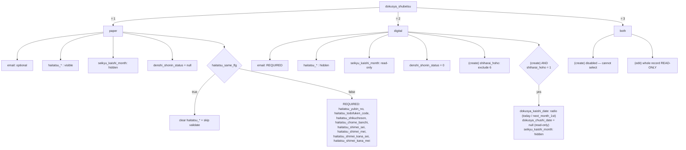
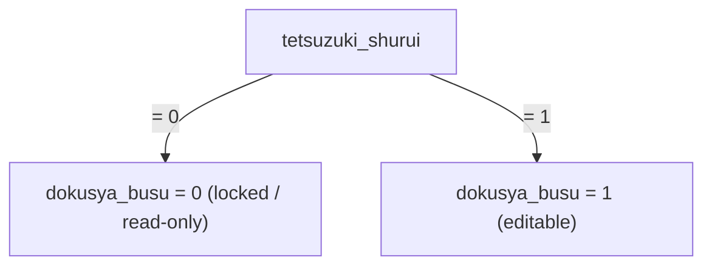
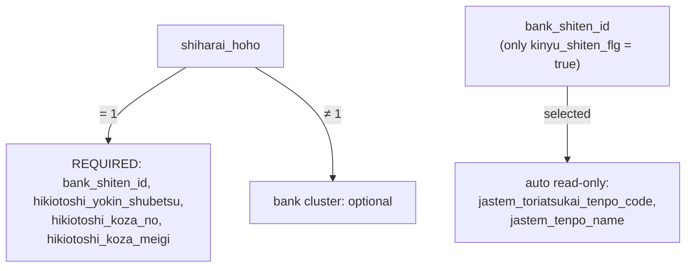
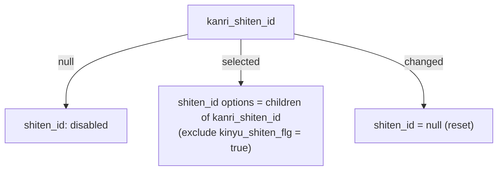
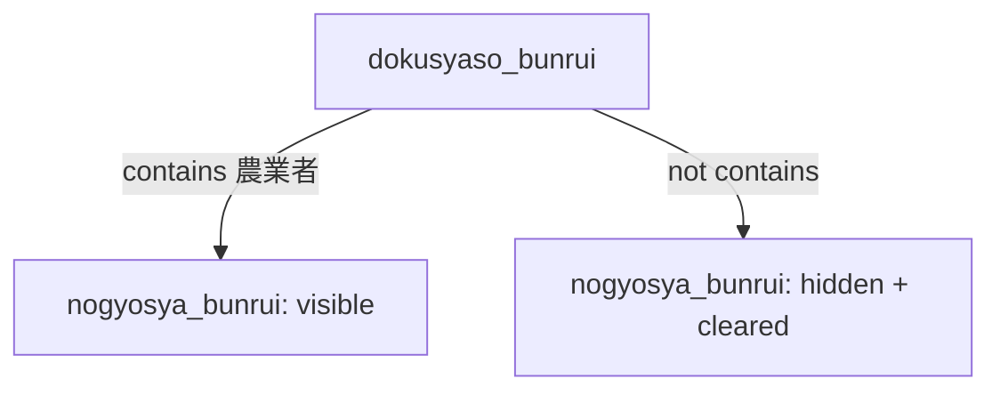

# ACSMS-SCR-011 — Sơ đồ trạng thái & phụ thuộc của các trường (購読者情報登録画面)

> Tài liệu mô tả **trạng thái có thể có của từng trường** trên màn hình tạo/sửa
> Người đọc báo (購読者) và **quan hệ điều kiện giữa các trường**: chọn giá trị
> nào ở trường này thì trường kia bị giới hạn / bắt buộc / ẩn / khóa ra sao.
>
> Nguồn suy ra (không suy diễn — toàn bộ từ code thực tế):
> - FE: [`apps/frontend/src/views/dokusya/DokusyaFormView.vue`](../../../apps/frontend/src/views/dokusya/DokusyaFormView.vue)
> - DTO: [`apps/backend/src/modules/dokusya/dto/create-dokusya.dto.ts`](../../../apps/backend/src/modules/dokusya/dto/create-dokusya.dto.ts)
> - Service: [`apps/backend/src/modules/dokusya/dokusya.service.ts`](../../../apps/backend/src/modules/dokusya/dokusya.service.ts)
> - Giá trị mã: [`docs/database/seeder.md §5`](../../database/seeder.md)
>
> Quy ước trình bày trường: **Tiếng Việt / 日本語 / `tên_cột_db`**.

---

## 0. Bảng giá trị mã (m_code) liên quan

Các trường dạng "chọn 1 trong N" lấy danh sách từ bảng `m_code` (label sửa được
runtime), còn **giá trị số** thì cố định như sau:

### 購読種別 `dokusya_shubetsu` (DOKUSYA_SHUBETSU)
| Giá trị | 日本語 | Tiếng Việt |
| --- | --- | --- |
| `1` | 紙版 | Bản giấy |
| `2` | 電子版 | Bản điện tử |
| `3` | 併読（紙版＋電子版） | Đọc song song (giấy + điện tử) |

### 手続種類 `tetsuzuki_shurui` (TETSUZUKI_SHURUI)
| Giá trị | 日本語 | Tiếng Việt |
| --- | --- | --- |
| `0` | 解約 | Hủy đăng ký |
| `1` | 新規 | Đăng ký mới |

### 支払方法 `shiharai_hoho` (SHIHARAI_HOHO)
| Giá trị | 日本語 | Tiếng Việt |
| --- | --- | --- |
| `1` | 口座引落 | Trích tài khoản ngân hàng |
| `2` | 現金集金 | Thu tiền mặt |
| `3` | 振込集金 | Thu qua chuyển khoản |
| `4` | JA施設等 | Tại cơ sở JA |
| `5` | 給与天引き | Trừ vào lương |
| `6` | クレジットカード | Thẻ tín dụng |
| `9` | その他 | Khác |

### 電子版読者種別 `denshi_dokusya_shubetsu` (DENSHI_DOKUSYA_SHUBETSU) — chỉ hiển thị, edit mode, read-only
| Giá trị | 日本語 | Tiếng Việt |
| --- | --- | --- |
| `0` | 無料 | Miễn phí |
| `1` | 有料 | Có phí |

### 預金種別 `hikiotoshi_yokin_shubetsu` (YOKIN_SHUBETSU)
| Giá trị | 日本語 | Tiếng Việt |
| --- | --- | --- |
| `1` | 普通 | Thường |
| `2` | 当座 | Vãng lai |

### 性別 `gender` (GENDER)
| Giá trị | 日本語 | Tiếng Việt |
| --- | --- | --- |
| `1` | 男性 | Nam |
| `2` | 女性 | Nữ |
| `9` | 回答しない | Không trả lời |

### 郵送区分 `yubin_kubun` (YUBIN_KUBUN) — lưu dạng chuỗi 1 ký tự
| Giá trị | 日本語 | Tiếng Việt |
| --- | --- | --- |
| `0` | 空 | (Trống) |
| `1` | 郵送 | Gửi bưu điện |

### メールマガジン `mail_magazine_flg` (MAIL_MAGAZINE_FLG)
| Giá trị | 日本語 | Tiếng Việt |
| --- | --- | --- |
| `0` | 配信しない | Không nhận |
| `1` | 配信する | Có nhận |

### 承認状態 `denshi_shonin_status` (không phải m_code — hằng số trong service)
| Giá trị | 日本語 | Tiếng Việt |
| --- | --- | --- |
| `0` | 承認待ち | Chờ duyệt |
| `1` | 承認 | Đã duyệt |
| `2` | 否認 | Từ chối |
| `null` | (紙版) | Không thuộc luồng duyệt (bản giấy) |

---

## 1. Trường luôn bắt buộc (không phụ thuộc điều kiện)

Các trường này **luôn bắt buộc** trong mọi tổ hợp:

| Trường (VN / 日本語 / cột) | Ràng buộc |
| --- | --- |
| Loại đăng ký / 購読種別 / `dokusya_shubetsu` | bắt buộc; xem §2 |
| Loại thủ tục / 手続種類 / `tetsuzuki_shurui` | bắt buộc; xem §3 |
| Chi nhánh / 支店 / `shiten_id` | bắt buộc (FK); xem §6 |
| Họ (Kanji) / 購読者氏名_氏 / `shimei_sei` | bắt buộc + **chỉ Kanji** |
| Tên (Kanji) / 購読者氏名_名 / `shimei_mei` | bắt buộc + **chỉ Kanji** |
| Họ (Hiragana) / 購読者かな_氏 / `shimei_kana_sei` | bắt buộc + **chỉ Hiragana** |
| Tên (Hiragana) / 購読者かな_名 / `shimei_kana_mei` | bắt buộc + **chỉ Hiragana** |
| Mã bưu chính / 郵便番号 / `yubin_no` | bắt buộc + **7 chữ số nửa độ rộng** |
| Tỉnh / 都道府県 / `todofuken_code` | bắt buộc |
| Quận/huyện/xã / 市町村郡 / `shikuchoson` | bắt buộc |
| Số nhà / 丁目番地 / `chome_banchi` | bắt buộc |
| Liên hệ 1 / 連絡先1 / `renrakusaki_1` | bắt buộc |
| Mã cửa hàng bán / 販売店コード / `hanbaiten_id` | bắt buộc (FK) |
| Đơn giá báo / 新聞単価 / `tanka_id` | bắt buộc (FK, lọc `tanka_type=1`) |
| Phương thức thanh toán / 支払方法 / `shiharai_hoho` | bắt buộc; xem §4 |
| Số lượng đặt / 購読部数 / `dokusya_busu` | bắt buộc (≥ 0); xem §3 |
| Ngày bắt đầu / 購読開始日 / `dokusya_kaishi_date` | bắt buộc; xem §7 (có ngoại lệ) |

> Các trường còn lại (建物名, 連絡先2, email, 生年, 性別, メルマガ, 組合員コード,
> 郵送区分, 購読料支払サイクル, 購読者層分類, 主な生産物, 備考, 購読中止日,
> 情報変更適用日) là **tùy chọn** trừ khi rơi vào điều kiện ở các mục dưới.

---

## 2. TRƯỜNG ĐIỀU KHIỂN CHÍNH: 購読種別 `dokusya_shubetsu`

Đây là trường chi phối nhiều nhất. Chọn giá trị nào sẽ kéo theo cả chuỗi thay đổi.

### 2.1. Giá trị nào được phép chọn

| Bối cảnh | `dokusya_shubetsu` được chọn |
| --- | --- |
| **Tạo mới (create)** | Chỉ giá trị mà tài khoản có quyền (cờ): `paper_flg` ⇒ 紙版(1), `denshi_flg` ⇒ 電子版(2). **併読(3) luôn bị khóa khi tạo mới.** |
| **Sửa (edit)** | **Không đổi được** — cả nhóm radio bị disable; BE ghim lại giá trị cũ. |

- Tài khoản chỉ có `denshi_flg` (không có `paper_flg`): khi tạo mới, form tự chọn sẵn 電子版(2).
- Nếu tổ hợp 購読種別 không khớp cờ tài khoản ⇒ nút Đăng ký/Cập nhật bị **disable** (BE cũng chặn 403 qua `assertShubetsuFlag`).

### 2.2. Nếu chọn 電子版(2) HOẶC 併読(3)  → `isDigitalOrBoth`

| Hệ quả lên trường khác |
| --- |
| **Email / メールアドレス / `email` → BẮT BUỘC** (và phải đúng định dạng). |
| **Toàn bộ Section "配達先情報" (địa chỉ giao hàng) bị ẩn** → mọi trường `haitatsu_*` không nhập, không validate. |
| **Tháng bắt đầu thu phí / 請求開始月 / `seikyu_kaishi_month` → hiển thị, READ-ONLY** (giá trị do hệ thống quản lý bản điện tử quyết định). *Ngoại lệ: create 電子版+口座引落 thì ẩn — xem §7.* |
| Khi tạo mới: `denshi_shonin_status` khởi tạo = **0 (chờ duyệt)**. |

### 2.3. Nếu chọn 紙版(1)

| Hệ quả lên trường khác |
| --- |
| Email **không bắt buộc**. |
| Section "配達先情報" **hiển thị** (xem §5). |
| 請求開始月 **ẩn**. |
| Khi tạo mới: `denshi_shonin_status` = **null** (bản giấy không thuộc luồng duyệt). |

### 2.4. Nếu chọn 電子版(2) — riêng khi TẠO MỚI

| Hệ quả |
| --- |
| **支払方法 `shiharai_hoho` bị loại bỏ giá trị クレジットカード(6)** khỏi danh sách chọn (thẻ tín dụng chỉ đến từ hệ thống bản điện tử, không nhập tay). Nếu đang chọn 6 mà đổi sang 電子版 thì giá trị bị xóa. BE cũng chặn (`assertDigitalPaymentMethod`). |

### 2.5. Bản ghi CHỈ ĐỌC (read-only) khi SỬA

Nếu (ở chế độ edit) bản ghi rơi vào 1 trong 2 trường hợp:
- 購読種別 = **併読(3)**, hoặc
- 購読種別 = **電子版(2) VÀ 支払方法 = クレジットカード(6)**

⇒ **Toàn bộ form bị disable, không lưu được** (BE trả 403 `DokusyaReadOnlyException`).
Vẫn mở xem được nhưng không cập nhật.

---

## 3. TRƯỜNG ĐIỀU KHIỂN: 手続種類 `tetsuzuki_shurui`

| Giá trị chọn | Hệ quả lên 購読部数 `dokusya_busu` & cờ lịch sử |
| --- | --- |
| **解約(0) — Hủy** | `dokusya_busu` bị **ép = 0 và READ-ONLY** (BE cũng ép 0). Lịch sử: `kaiyaku_flg=true`, `shinki_flg=false`. |
| **新規(1) — Mới** | `dokusya_busu` mặc định **= 1**, cho nhập. Lịch sử: `shinki_flg=true`, `kaiyaku_flg=false`. |

> Khi đổi giá trị `tetsuzuki_shurui`, FE tự set lại `dokusya_busu` (0 hoặc 1).
> Ở chế độ edit khi đang nạp dữ liệu (`isHydrating`) thì giữ nguyên giá trị đã lưu.

---

## 4. TRƯỜNG ĐIỀU KHIỂN: 支払方法 `shiharai_hoho`

### 4.1. Nếu chọn 口座引落(1) — Trích tài khoản

⇒ **Cụm thông tin ngân hàng trở thành BẮT BUỘC**:

| Trường (VN / 日本語 / cột) |
| --- |
| Chi nhánh tài khoản trích / 引落口座支店 / `bank_shiten_id` |
| Loại tiền gửi / 引落口座貯金種目 / `hikiotoshi_yokin_shubetsu` |
| Số tài khoản / 引落口座番号 / `hikiotoshi_koza_no` |
| Tên chủ tài khoản / 引落口座名義 / `hikiotoshi_koza_meigi` |

### 4.2. Nếu chọn giá trị KHÁC 口座引落

⇒ Cụm ngân hàng **không bắt buộc**. Nhưng nếu người dùng vẫn nhập `bank_shiten_id`
thì BE vẫn kiểm tra hợp lệ (đúng JA, là chi nhánh tài chính). Không nhập thì lưu rỗng.

### 4.3. Phụ thuộc theo lựa chọn `bank_shiten_id`

| Điều kiện | Hệ quả |
| --- | --- |
| Danh sách chọn `bank_shiten_id` | **Chỉ gồm chi nhánh tài chính** (`kinyu_shiten_flg = true`). |
| Sau khi chọn `bank_shiten_id` | Tự động **hiển thị READ-ONLY** 2 trường: Mã cửa hàng tài khoản / 引落元口座店舗コード / `jastem_toriatsukai_tenpo_code` và Tên cửa hàng / 引落元口座店舗名 / `jastem_tenpo_name` (BE reverse-lookup từ `m_shiten`). |

---

## 5. TRƯỜNG ĐIỀU KHIỂN: 配達先＝購読者情報と同じ `haitatsu_same_flg`

> **Tiền đề:** cụm này chỉ có ý nghĩa khi 購読種別 = 紙版(1). Với 電子版/併読 cả
> section bị ẩn (xem §2.2) nên cờ này không được tham chiếu.

| Giá trị | Hệ quả lên cụm `haitatsu_*` (địa chỉ + tên người nhận) |
| --- | --- |
| **true (cùng địa chỉ người đọc)** | **Xóa sạch** mọi trường `haitatsu_*`, **bỏ qua validate** (block nhập bị ẩn bằng `v-show`). |
| **false (địa chỉ khác) + 紙版** | Cụm sau trở thành **BẮT BUỘC**: `haitatsu_yubin_no` (7 số), `haitatsu_todofuken_code`, `haitatsu_shikuchoson`, `haitatsu_chome_banchi`, `haitatsu_shimei_sei`, `haitatsu_shimei_mei`, `haitatsu_shimei_kana_sei` (Hiragana), `haitatsu_shimei_kana_mei` (Hiragana). Còn `haitatsu_tatemono_mei`, `haitatsu_renrakusaki_1/2` vẫn tùy chọn. |

> BE (DTO `isHaitatsuAddressRequired`): điều kiện bắt buộc = `haitatsu_same_flg=false`
> **AND** `dokusya_shubetsu=1 (紙版)`. Ngoài điều kiện đó, nếu có nhập thì chỉ
> kiểm tra định dạng/độ dài.

---

## 6. TRƯỜNG ĐIỀU KHIỂN: 管理支店 `kanri_shiten_id` → 支店 `shiten_id`

| Trạng thái `kanri_shiten_id` | Hệ quả lên `shiten_id` |
| --- | --- |
| **Chưa chọn (null)** | Dropdown 支店 bị **disable**, placeholder "管理支店を先に選択してください". |
| **Đã chọn** | Danh sách 支店 chỉ gồm chi nhánh thuộc 管理支店 đó **và loại bỏ chi nhánh tài chính** (`kinyu_shiten_flg ≠ true`). |
| **Đổi sang 管理支店 khác** | `shiten_id` đang chọn bị **xóa về null** (trừ lúc đang nạp dữ liệu edit). |

---

## 7. Tổ hợp đặc biệt: TẠO MỚI + 電子版(2) + 口座引落(1)  → `isDigitalKozaCreate`

Đây là yêu cầu nghiệp vụ riêng (chỉ ở chế độ tạo mới):

| Trường | Hành vi khi rơi vào tổ hợp này |
| --- | --- |
| Ngày bắt đầu / 購読開始日 / `dokusya_kaishi_date` | Thay date-picker bằng **radio 2 lựa chọn: 今日 (hôm nay) / 翌月1日 (ngày 1 tháng sau)**, mặc định 今日. Giá trị lưu được tính ra từ radio. Không còn bắt buộc nhập tay. |
| Ngày dừng / 購読中止日 / `dokusya_chushi_date` | **READ-ONLY, để trống**, placeholder "月末で終了" (kết thúc cuối tháng). Khi submit gửi **null**. |
| Tháng bắt đầu thu phí / 請求開始月 / `seikyu_kaishi_month` | **Ẩn**; khi submit gửi chuỗi rỗng. |

> Các tổ hợp khác giữ logic mặc định: 購読開始日 dùng date-picker (chế độ edit thì
> read-only); 購読中止日 dùng date-picker, **trừ** trường hợp edit + (電子版+クレカ
> hoặc 併読) thì hiển thị tháng YYYY/MM read-only kèm "月末で終了".

---

## 8. Nút thao tác phụ thuộc trạng thái duyệt (chỉ edit)

| Điều kiện | Nút hiển thị |
| --- | --- |
| Tạo mới (`!isEdit`) | **登録 (Đăng ký)** → gọi `createDokusya`. |
| Sửa + KHÔNG ở trạng thái chờ duyệt | **更新 (Cập nhật)** → gọi `updateDokusya`. |
| Sửa + `denshi_shonin_status = 0` (chờ duyệt) + tài khoản có `denshi_flg` | **承認・登録 (Duyệt & lưu)** → `approveDokusya`, kèm nút **承認しない (Từ chối)** → `rejectDokusya`. |

> Nút Đăng ký/Cập nhật bị **disable** khi: tổ hợp 購読種別 không khớp cờ tài khoản,
> hoặc bản ghi ở trạng thái read-only (§2.5).

---

## 9. Trường điều khiển: 読者属性 `dokusyaso_bunrui` → 主な生産物 `nogyosya_bunrui`

> `dokusyaso_bunrui` là multi-select lưu dạng CSV (chuỗi). Các lựa chọn cố định ở FE:
> 農業者 / 企業・団体 / その他 / JAグループ役職員 / 学生.

| Điều kiện | Hệ quả |
| --- | --- |
| Trong `dokusyaso_bunrui` **có chọn 「農業者」** (Nông dân) | **Hiện** trường Sản phẩm chính / 主な生産物 / `nogyosya_bunrui` (multi-select: 米/野菜/果実/花/畜産/その他). |
| **Bỏ chọn 農業者** | **Ẩn** và **xóa** `nogyosya_bunrui`. |

---

## 10. Các kiểm tra định dạng độc lập (luôn áp dụng khi có giá trị)

| Trường | Luật |
| --- | --- |
| 氏名_氏 / _名 (`shimei_sei`, `shimei_mei`) | Chỉ **Kanji** (kèm 々〇 và Kanji tương thích). |
| かな_氏 / _名 (`shimei_kana_sei/mei`) + 配達先かな | Chỉ **Hiragana**. |
| 郵便番号 / 配達先郵便番号 | **7 chữ số nửa độ rộng**. |
| メールアドレス (`email`) | Định dạng email; trùng email trong cùng JA ⇒ lỗi `DUPLICATE_EMAIL`. |
| 情報変更適用日 (`joho_henko_tekiyo_date`) | Nếu có nhập, phải là **ngày tương lai** (BE chuẩn JST). |
| 備考 (`biko`) | Tối đa **500 ký tự**. |

---

## 11. Sơ đồ phụ thuộc (chỉ tên cột vật lý)

### 11.1. dokusya_shubetsu (trường điều khiển chính)

### 11.2. tetsuzuki_shurui → dokusya_busu

### 11.3. shiharai_hoho + bank_shiten_id

### 11.4. kanri_shiten_id → shiten_id

### 11.5. dokusyaso_bunrui → nogyosya_bunrui

---

## 12. Bảng trạng thái theo từng case

> Ký hiệu: **REQ** = bắt buộc · **OPT** = tùy chọn · **HIDE** = ẩn ·
> **R/O** = read-only (khóa, không sửa) · **CLR** = bị xóa giá trị · — = không đổi.

### 12.1. Case theo `dokusya_shubetsu`

| `dokusya_shubetsu` | `email` | Section `haitatsu_*` | `seikyu_kaishi_month` | `denshi_shonin_status` (create) | `shiharai_hoho` chọn được | Create | Edit |
| --- | --- | --- | --- | --- | --- | --- | --- |
| `1` (paper) | OPT | visible | HIDE | `null` | tất cả (1–6, 9) | ✔ (cần `paper_flg`) | sửa được |
| `2` (digital) | **REQ** | HIDE | R/O | `0` | tất cả **trừ `6`** (create) | ✔ (cần `denshi_flg`) | sửa được; nếu `shiharai_hoho=6` → R/O toàn form |
| `3` (both) | **REQ** | HIDE | R/O | `0` | — | ✘ disabled | **R/O toàn form** |

### 12.2. Case theo `haitatsu_same_flg` (chỉ áp dụng khi `dokusya_shubetsu = 1`)

| `haitatsu_same_flg` | `haitatsu_yubin_no` · `haitatsu_todofuken_code` · `haitatsu_shikuchoson` · `haitatsu_chome_banchi` · `haitatsu_shimei_sei` · `haitatsu_shimei_mei` · `haitatsu_shimei_kana_sei` · `haitatsu_shimei_kana_mei` | `haitatsu_tatemono_mei` · `haitatsu_renrakusaki_1` · `haitatsu_renrakusaki_2` |
| --- | --- | --- |
| `true` | CLR (skip validate) | CLR |
| `false` | **REQ** | OPT |

### 12.3. Case theo `tetsuzuki_shurui`

| `tetsuzuki_shurui` | `dokusya_busu` | `shinki_flg` (lịch sử) | `kaiyaku_flg` (lịch sử) |
| --- | --- | --- | --- |
| `0` (cancel) | `0` · R/O | `false` | `true` |
| `1` (new) | `1` · editable | `true` | `false` |

### 12.4. Case theo `shiharai_hoho` + `bank_shiten_id`

| `shiharai_hoho` | `bank_shiten_id` | `hikiotoshi_yokin_shubetsu` | `hikiotoshi_koza_no` | `hikiotoshi_koza_meigi` | `jastem_toriatsukai_tenpo_code` · `jastem_tenpo_name` |
| --- | --- | --- | --- | --- | --- |
| `1` (koza) | **REQ** | **REQ** | **REQ** | **REQ** | auto · R/O (sau khi chọn `bank_shiten_id`) |
| `≠ 1` | OPT | OPT | OPT | OPT | auto · R/O (nếu có chọn `bank_shiten_id`) |

> `bank_shiten_id` chỉ liệt kê chi nhánh có `kinyu_shiten_flg = true`.

### 12.5. Case theo `kanri_shiten_id` → `shiten_id`

| Trạng thái `kanri_shiten_id` | `shiten_id` |
| --- | --- |
| `null` (chưa chọn) | disabled |
| đã chọn | options = chi nhánh con của `kanri_shiten_id`, loại `kinyu_shiten_flg = true` |
| đổi sang giá trị khác | `shiten_id` = `null` (CLR) |

### 12.6. Case theo `dokusyaso_bunrui` → `nogyosya_bunrui`

| `dokusyaso_bunrui` | `nogyosya_bunrui` |
| --- | --- |
| chứa `農業者` | visible · OPT |
| không chứa | HIDE · CLR |

### 12.7. Bảng tổng hợp các tổ hợp chính (end-to-end)

| # | mode | `dokusya_shubetsu` | `shiharai_hoho` | `haitatsu_same_flg` | `tetsuzuki_shurui` | Kết quả nổi bật |
| --- | --- | --- | --- | --- | --- | --- |
| 1 | create | `1` paper | `2` (vd) | `true` | `1` | `email` OPT · `haitatsu_*` CLR · `dokusya_busu=1` · `seikyu_kaishi_month` HIDE · `denshi_shonin_status=null` |
| 2 | create | `1` paper | `2` | `false` | `1` | như #1 nhưng cụm `haitatsu_*` **REQ** |
| 3 | create | `1` paper | `2` | `true` | `0` | `dokusya_busu=0` R/O · còn lại như #1 |
| 4 | create | `2` digital | `1` koza | (n/a, HIDE) | `1` | `email` **REQ** · `bank_*` **REQ** · `dokusya_kaishi_date` = radio today/next_month_1st · `dokusya_chushi_date=null` R/O · `seikyu_kaishi_month` HIDE · `denshi_shonin_status=0` |
| 5 | create | `2` digital | `2` genkin | (n/a) | `1` | `email` **REQ** · `bank_*` OPT · `dokusya_kaishi_date` date-picker · `seikyu_kaishi_month` R/O · `denshi_shonin_status=0` |
| 6 | create | `2` digital | `6` credit | — | — | **bị chặn** (FE loại bỏ option 6; BE trả VALIDATION_ERROR) |
| 7 | create | `3` both | — | — | — | **bị chặn** (option disabled khi create) |
| 8 | edit | `1` paper | bất kỳ | theo dữ liệu | bất kỳ | `dokusya_shubetsu` R/O · `dokusya_kaishi_date` R/O · các luật §12.1–12.6 áp dụng |
| 9 | edit | `2` digital | `1` koza | (HIDE) | bất kỳ | nếu `denshi_shonin_status=0` + `denshi_flg`: nút **approve / reject**; ngược lại nút **update** |
| 10 | edit | `2` digital | `6` credit | — | — | **R/O toàn form** (không lưu được; BE 403) |
| 11 | edit | `3` both | — | — | — | **R/O toàn form** (không lưu được; BE 403) |
